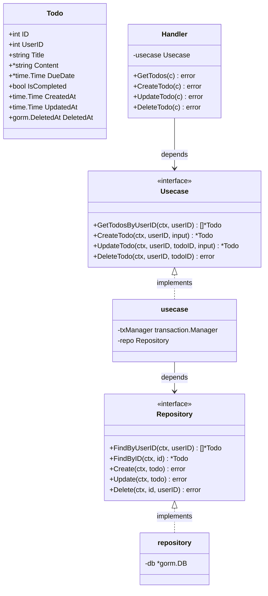

# バックエンド アーキテクチャ設計書

## 設計方針

Package by Feature + Clean Architecture

機能（todo, user）ごとに1パッケージとし、パッケージ内でクリーンアーキテクチャの各レイヤーを**ファイル単位**で表現する（レイヤーごとのサブパッケージには分割しない）。

`notification/`（通知バッチ）も同じ依存方向の Clean Architecture を採用している。外部とのI/FがHTTPハンドラーかSESメール送信かという点が異なるほか、notification 側はレイヤーをディレクトリ（domain / usecase / infrastructure）で分割している。

### レイヤーをサブパッケージに分割しなかった理由

- 機能単位の凝集を優先した。1機能のコードが1ディレクトリに収まり、変更が局所化する
- 現在の規模（2機能・各5ファイル程度）でレイヤーごとにパッケージを切ると、import とボイラープレートが実装量に対して過大になる
- **トレードオフ**: 同一パッケージ内のため、handler → usecase → domain の依存方向はコンパイラでは強制されない。ファイル名 = レイヤーの命名規約と、handler が `Usecase` インターフェースのみを保持する構造、およびコードレビューで担保する
- 機能が肥大化した場合は、notification/ と同様にレイヤーをサブパッケージへ切り出す

---

## ディレクトリ構造

```
backend/
  cmd/
    main.go              # エントリポイント（DB接続・DI・ルーティング・graceful shutdown）
    migrate/
      main.go            # DBマイグレーション実行（golang-migrate）

  todo/                  # todo機能（1パッケージ内でレイヤーをファイル分割）
    entity.go            # Todo struct（ドメイン層）
    repository.go        # Repository interface（ドメイン層）
    repository_impl.go   # Repository の GORM実装（インフラ層）
    usecase.go           # Usecase interface・実装・入力型(CreateInput / UpdateInput)
    usecase_test.go
    handler.go           # HTTPハンドラー・レスポンス型(TodoResponse / TodoListResponse)・DateOnly
    handler_test.go

  user/                  # user機能（構成はtodoと同じ）
    entity.go            # User struct
    repository.go        # Repository interface
    repository_impl.go   # Repository の GORM実装
    usecase.go           # Usecase interface・実装（FindOrCreateByFirebaseUID）
    usecase_test.go

  auth/
    middleware.go        # Firebase認証ミドルウェア（IDトークン検証→ユーザー解決→contextへ格納）

  infrastructure/
    database/
      database.go        # DB接続（MySQL / GORM・コネクションプール設定）
      transaction.go     # transaction.Manager 実装・GetTx（contextからのトランザクション取得）
    firebase/
      firebase.go        # Firebase Auth クライアント初期化

  shared/                # 全レイヤーから参照される横断的関心事
    transaction/
      transaction.go     # Manager interface
    appcontext/
      context.go         # userID の context accessor
    errors/
      errors.go          # AppError（コード・メッセージ・原因のラップ）
      codes.go           # ErrorCode と HTTPステータスのマッピング
      errors_test.go

  db/
    migrations/          # SQLマイグレーションファイル（golang-migrate形式）
```

---

## クラス図

todo 機能を例に、各レイヤーの型と依存関係を示す。



---

## 各レイヤーの責務

### entity.go / repository.go（ドメイン層）
- エンティティの定義
- リポジトリインターフェースの定義

### usecase.go（ユースケース層）
- ビジネスロジックの実装（所有者チェック・トランザクション境界の決定）
- `Repository` インターフェースと `transaction.Manager` にのみ依存
- 入力型（CreateInput / UpdateInput）を定義

### handler.go（インターフェース層）
- Echo のHTTPハンドラー実装
- リクエストのバインド・バリデーション
- レスポンス型（TodoResponse / TodoListResponse）と日付表現（DateOnly）を定義
- `Usecase` インターフェースにのみ依存
- `AppError` のエラーコードをHTTPステータスへ変換

### repository_impl.go / infrastructure/（インフラ層）
- GORM によるリポジトリ実装（`GetTx` でcontext内のトランザクションを優先使用）
- DB接続・トランザクション管理
- Firebase Auth クライアント

---

## 依存関係

```
cmd/main.go
  ├── todo   (Handler / Usecase / Repository の生成とDI)
  ├── user   (Usecase / Repository の生成とDI)
  ├── auth
  ├── infrastructure/database
  └── infrastructure/firebase

todo パッケージ内（ファイル間の依存方向）
  handler.go          → usecase.go (Usecase interface)、shared/appcontext、shared/errors
  usecase.go          → repository.go (Repository interface)、shared/transaction、shared/errors
  repository_impl.go  → infrastructure/database (GetTx)、shared/errors

user パッケージ内
  usecase.go          → repository.go (Repository interface)、shared/errors
  repository_impl.go  → infrastructure/database (GetTx)、shared/errors

auth/middleware.go
  ├── user             (Usecase interface)
  └── shared/appcontext

infrastructure/database/transaction.go
  └── shared/transaction (Manager interface の実装)
```

**原則: 依存の向きは常に 外側 → 内側**
`repository_impl.go`（インフラ）→ `repository.go`（ドメインI/F）は OK。エンティティ・インターフェースがGORM実装やEchoを参照するのはNG。
同一パッケージ内のためコンパイラによる強制はなく、上記のファイル間依存方向をレビューで維持する。

---

## パッケージ名一覧

| ディレクトリ                | package名     |
|----------------------------|---------------|
| `cmd/`                     | `main`        |
| `cmd/migrate/`             | `main`        |
| `todo/`                    | `todo`        |
| `user/`                    | `user`        |
| `auth/`                    | `auth`        |
| `infrastructure/database/` | `database`    |
| `infrastructure/firebase/` | `firebase`    |
| `shared/transaction/`      | `transaction` |
| `shared/appcontext/`       | `appcontext`  |
| `shared/errors/`           | `errors`      |
