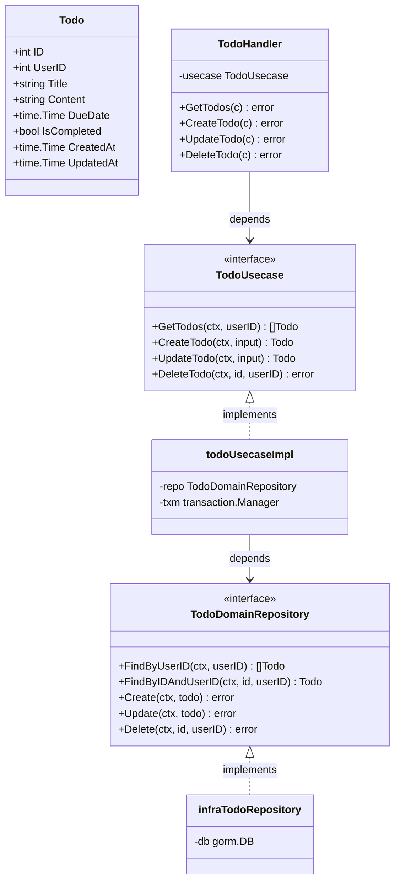

# バックエンド アーキテクチャ設計書

## 設計方針

Package by Feature + Clean Architecture

各機能（todo, user）のパッケージ内に、クリーンアーキテクチャのレイヤーをディレクトリで表現する。

`notification/`（通知バッチ）も同じ Clean Architecture を採用しており、依存の向きは共通。外部とのI/FがHTTPハンドラーかSESメール送信かという点だけが異なる。

---

## ディレクトリ構造

```
backend/
  cmd/
    main.go

  todo/
    domain/
      entity.go        # Todo struct
      repository.go    # Repository interface
    usecase/
      usecase.go       # Usecase interface・実装・入力型(CreateInput / UpdateInput)
      usecase_test.go
    handler/
      handler.go       # HTTPハンドラー・レスポンス型(Response / ListResponse)
      handler_test.go

  user/
    domain/
      entity.go        # User struct
      repository.go    # Repository interface
    usecase/
      usecase.go       # Usecase interface・実装

  auth/
    middleware.go      # Firebase認証ミドルウェア

  infrastructure/
    database/
      database.go      # DB接続
      transaction.go   # transaction.Manager 実装
    firebase/
      firebase.go      # Firebase Auth 初期化
    todo/
      repository.go    # todo/domain.Repository の GORM実装
    user/
      repository.go    # user/domain.Repository の GORM実装

  pkg/
    transaction/
      transaction.go   # Manager interface
    appcontext/
      context.go       # userID の context accessor
    errors/
      errors.go
      codes.go
      errors_test.go
```

---

## クラス図

todo 機能を例に、各レイヤーのクラスと依存関係を示す。



---

## 各レイヤーの責務

### domain（ドメイン層）
- エンティティの定義
- リポジトリインターフェースの定義
- 外部への依存なし

### usecase（ユースケース層）
- ビジネスロジックの実装
- `domain.Repository` と `transaction.Manager` にのみ依存
- 入力型（CreateInput / UpdateInput）を定義

### handler（インターフェース層）
- Echo のHTTPハンドラー実装
- リクエストのバインド・バリデーション
- レスポンス型（Response / ListResponse）を定義
- `usecase.Usecase` にのみ依存

### infrastructure（インフラ層）
- GORM によるリポジトリ実装
- DB接続・トランザクション管理
- Firebase Auth クライアント

---

## 依存関係

```
cmd/main.go
  ├── todo/handler
  ├── todo/usecase
  ├── user/usecase
  ├── auth
  ├── infrastructure/database
  ├── infrastructure/firebase
  ├── infrastructure/todo
  └── infrastructure/user

todo/handler
  ├── todo/usecase   (Usecase interface)
  └── pkg/appcontext

todo/usecase
  ├── todo/domain    (Repository interface, Todo)
  └── pkg/transaction

user/usecase
  └── user/domain    (Repository interface, User)

auth/middleware
  ├── user/usecase   (Usecase interface)
  └── pkg/appcontext

infrastructure/todo
  ├── todo/domain    (Repository interface, Todo)
  └── infrastructure/database

infrastructure/user
  ├── user/domain    (Repository interface, User)
  └── infrastructure/database

infrastructure/database/transaction.go
  └── pkg/transaction
```

**原則: 依存の向きは常に外側 → 内側**
`infrastructure` → `domain` は OK。`domain` → `infrastructure` はNG。

---

## パッケージ名一覧

| ディレクトリ              | package名    |
|--------------------------|-------------|
| `todo/domain/`           | `domain`    |
| `todo/usecase/`          | `usecase`   |
| `todo/handler/`          | `handler`   |
| `user/domain/`           | `domain`    |
| `user/usecase/`          | `usecase`   |
| `auth/`                  | `auth`      |
| `infrastructure/database/` | `database` |
| `infrastructure/firebase/` | `firebase` |
| `infrastructure/todo/`   | `todo`      |
| `infrastructure/user/`   | `user`      |
| `pkg/transaction/`       | `transaction` |
| `pkg/appcontext/`        | `appcontext` |
| `pkg/errors/`            | `errors`    |
