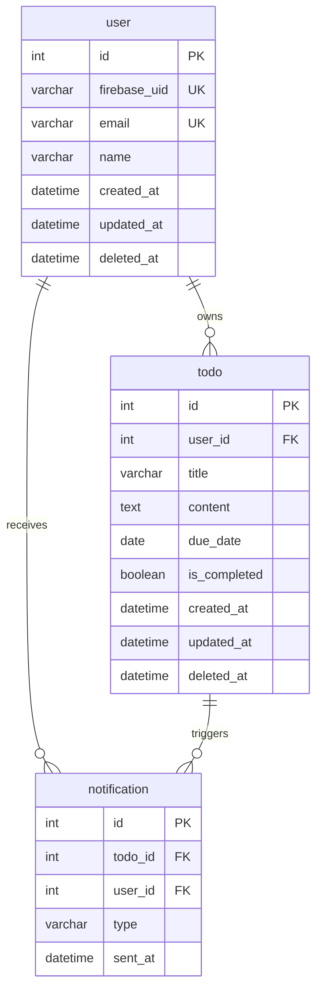

# TODOアプリ 設計書

## 概要

Firebase Authentication で認証済みユーザーが自身の TODO を管理するWebアプリケーション。  
期日が近づいた・超過した TODO をメールで通知するバッチ機能を持つ。

---

## システム構成

### 技術スタック

| レイヤー | 技術 |
|--------|------|
| フロントエンド | Vue.js（Vite） |
| バックエンドAPI | Go / Echo |
| 通知バッチ | Go（ECS RunTask） |
| 認証 | Firebase Authentication |
| DB | MySQL 8.0（Amazon RDS） |
| ORM | GORM v2 |
| メール送信 | Amazon SES |
| インフラ | AWS（ECS Fargate / RDS / S3+CloudFront / Route53） |
| IaC | Terraform |

### アーキテクチャ概要

```
[ユーザー]
    │
    ├── ブラウザ (Vue.js)
    │       │  Firebase SDK でサインイン → ID Token 取得
    │       │  Bearer Token で API 呼び出し
    │       ▼
    │   CloudFront + S3（静的ホスティング）
    │
    └── APIリクエスト (Authorization: Bearer <ID Token>)
            ▼
        ALB
            ▼
        ECS Fargate（バックエンドAPI）
            │  Firebase Admin SDK で Token 検証
            │
            ▼
        RDS MySQL 8.0（プライベートサブネット）

[定期バッチ]
EventBridge Scheduler（毎日 09:00 JST）
    ▼
ECS RunTask（パブリックサブネット）
    ├── RDS（同一VPC内通信）
    └── SES（インターネット経由）
```

### インフラ補足

- フロントエンドは S3 + CloudFront で静的配信（独自ドメインは Route53 + ACM）
- バックエンドAPIは ECS Fargate（プライベートサブネット） + ALB で公開
- 通知バッチは ECS RunTask をパブリックサブネットに配置することで、NAT Gateway なしで SES へ接続
- RDS はプライベートサブネットに配置し、VPC 内通信のみ許可

---

## 機能要件

### ユーザー登録・認証

- Firebase Authentication でユーザー認証を行う
- ユーザー登録・ログイン・ログアウトはフロントエンドで Firebase SDK を使用
- バックエンドは Firebase Admin SDK で ID Token（JWT）を検証し、Firebase UID からユーザーを識別する
- 初回アクセス時、Firebase UID をキーに `user` テーブルへレコードを自動作成する

### TODO管理

| 機能 | 説明 |
|------|------|
| 一覧取得 | 自分の TODO を作成日時降順で取得 |
| 作成 | タイトル（必須）・内容・期日を登録 |
| 更新 | タイトル・内容・期日・完了フラグを更新 |
| 削除 | 論理削除（`deleted_at` に日時をセット） |

**TODO フィールド仕様**

| フィールド | 必須 | 制約 |
|-----------|------|------|
| title | YES | 最大100文字 |
| content | NO | NULL許容 |
| due_date | NO | NULL許容、YYYY-MM-DD形式 |
| is_completed | YES | デフォルト false |


### メール通知

未完了かつ期日が設定されている TODO を対象に、1日1回バッチで通知メールを送信する。

**通知種別**

| 種別 | 条件 | 件名 |
|------|------|------|
| `approaching` | 期日まで3日以内（当日含む） | `【期日間近】{title}` |
| `overdue` | 期日超過 | `【期日超過】{title}` |

**仕様**

- 1日1回送信（同一TODO への当日の重複送信は防止）
- overdue の TODO には approaching は送らない
- メール送信成功後に通知レコードを保存する（送信前に保存すると、送信失敗時に永久スキップになるため）
- バッチ実行は EventBridge Scheduler で毎日 09:00 JST に起動

---

## DB設計

### userテーブル

| カラム名 | 型 | NULL | キー | デフォルト | 説明 |
|----------|-----|------|------|------------|------|
| id | INT | NO | PK | AUTO_INCREMENT | ユーザーID |
| firebase_uid | VARCHAR(128) | NO | UNIQUE | - | Firebase UID |
| email | VARCHAR(255) | NO | UNIQUE | - | メールアドレス |
| name | VARCHAR(100) | NO | - | - | ユーザー名 |
| created_at | DATETIME | NO | - | CURRENT_TIMESTAMP | 作成日時 |
| updated_at | DATETIME | NO | - | CURRENT_TIMESTAMP ON UPDATE | 更新日時 |
| deleted_at | DATETIME | YES | - | NULL | 削除日時（論理削除） |

### todoテーブル

| カラム名 | 型 | NULL | キー | デフォルト | 説明 |
|----------|-----|------|------|------------|------|
| id | INT | NO | PK | AUTO_INCREMENT | TODO ID |
| user_id | INT | NO | FK(user.id) | - | ユーザーID |
| title | VARCHAR(255) | NO | - | - | タイトル |
| content | TEXT | YES | - | NULL | 内容 |
| due_date | DATE | YES | - | NULL | 期日 |
| is_completed | BOOLEAN | NO | - | FALSE | 完了フラグ |
| created_at | DATETIME | NO | - | CURRENT_TIMESTAMP | 作成日時 |
| updated_at | DATETIME | NO | - | CURRENT_TIMESTAMP ON UPDATE | 更新日時 |
| deleted_at | DATETIME | YES | - | NULL | 削除日時（論理削除） |

### notificationテーブル

| カラム名 | 型 | NULL | キー | デフォルト | 説明 |
|----------|-----|------|------|------------|------|
| id | INT | NO | PK | AUTO_INCREMENT | 通知ID |
| todo_id | INT | NO | FK(todo.id) | - | TODO ID |
| user_id | INT | NO | FK(user.id) | - | ユーザーID |
| type | VARCHAR(32) | NO | - | - | 通知種別（`approaching` / `overdue`） |
| sent_at | DATETIME | NO | - | CURRENT_TIMESTAMP | 送信日時 |

### ER図



### インデックス

| テーブル | カラム | 種別 |
|---------|--------|------|
| user | firebase_uid | UNIQUE |
| user | email | UNIQUE |
| todo | user_id | INDEX |
| notification | todo_id | INDEX |
| notification | user_id | INDEX |

※ 性能問題が発生した場合に複合インデックスの追加を検討する。

### 外部キー制約

| 制約 | ON DELETE |
|------|-----------|
| todo.user_id → user.id | RESTRICT |
| notification.todo_id → todo.id | CASCADE |
| notification.user_id → user.id | RESTRICT |

---

## 関連ドキュメント

| ドキュメント | 内容 |
|-------------|------|
| [API設計書](./API設計書.md) | エンドポイント詳細・リクエスト/レスポンス仕様・エラーコード |
| [バックエンド アーキテクチャ設計書](../backend/README.md) | Clean Architecture のレイヤー構成・依存関係 |
| [メール通知バッチ 設計書](../notification/README.md) | バッチの起動フロー・エラーハンドリング・テスト仕様 |
| [定期メール送信アーキテクチャ比較](./EMAIL_SCHEDULER_ARCHITECTURE.md) | Lambda vs ECS RunTask の採用検討記録 |
